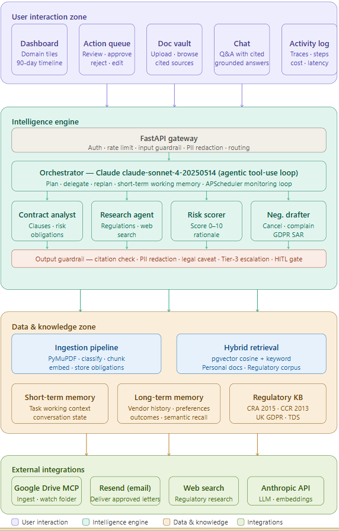
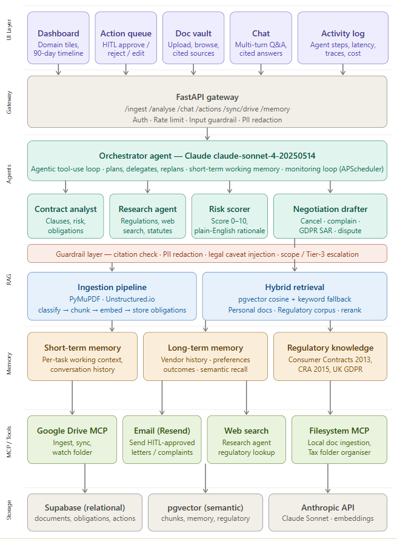
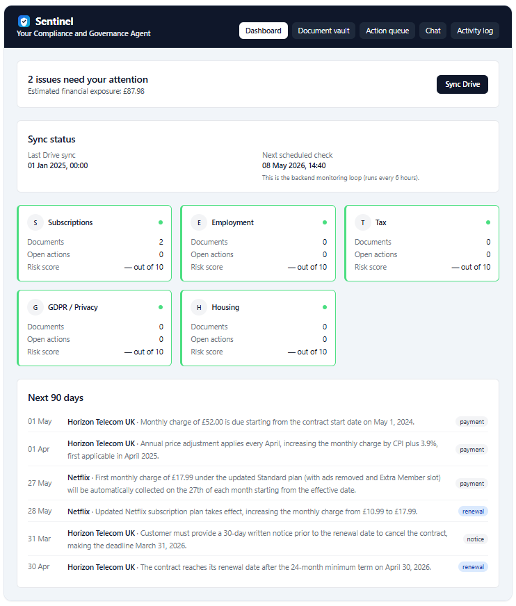

# sentinel — Drive Sync Backend Integration

A Python (FastAPI) backend integration that **syncs PDF/DOCX/TXT documents from a restricted Google Drive folder** into a **Supabase (Postgres) database**, so downstream services can search, analyse, and take actions on the content.

This tool solves the “admin debt” problem of manually tracking contracts and compliance documents by keeping your database up to date with the latest files from Drive in a controlled, auditable way.

---

## Solution architecture

High-level view of how user-facing surfaces, the intelligence engine (FastAPI + orchestrator + specialist agents), data and retrieval (ingestion, hybrid RAG, memory), and external integrations fit together.



### Logical technical architecture

Layered view of the stack: UI → FastAPI gateway → orchestrator and sub-agents → guardrails → RAG (ingestion + hybrid retrieval) → memory → MCP/tools → Supabase and pgvector storage.



---

## Features

- **Restricted Google Drive sync**: only ingests documents from a single configured folder (`DRIVE_FOLDER_ID`).
- **Document ingestion pipeline**:
  - downloads files (PDF, DOCX, TXT)
  - extracts text (PDF supported in the current stack)
  - stores document metadata + raw text in Supabase
  - chunks and embeds text for semantic search (pgvector)
- **Deduplication**:
  - content-based dedupe (`content_hash`)
  - source-based dedupe (`source_fingerprint` like `gdrive:<file_id>`)
- **Operational transparency**:
  - stores and exposes **last Drive sync** time
  - supports scheduled monitoring runs (APScheduler) plus manual triggers
- **Developer-friendly API**: trigger sync via `POST /sync/drive` and inspect results as JSON.
- **Frontend application (React)**: a simple UI that exposes the full workflow (upload → analyse → review → send) across five tabs.

---

## Frontend tabs (what each tab does)

The frontend is a React app with five primary tabs. Together, they let a user ingest documents, ask questions, review agent outputs, and approve actions safely.

### 1) Dashboard

The “at a glance” status page. It answers: **“Is the system working and what do I need to do next?”**

- Shows aggregated counts (documents, pending actions, upcoming obligations).
- Shows operational sync status:
  - **Last Drive sync time** (when Drive was last checked successfully)
  - **Next scheduled sync time** (when monitoring will run next)
- Highlights risk by domain (e.g., subscription, housing) using a simple red/amber/green status.



### 2) Document Vault

The document library. It answers: **“What documents have I uploaded/synced and what did the system extract?”**

- Upload PDF/TXT documents manually.
- View all ingested documents with key metadata (vendor, domain, dates, summary).
- See processing outcomes like chunk counts and obligation counts (where available).


### 3) Chat

A Q&A interface over your ingested documents. It answers: **“Where in my documents does it say X?”**

- You ask natural language questions (e.g., “When does this contract expire?”).
- The backend retrieves relevant chunks (semantic + keyword) and returns a grounded answer.
- The UI displays “sources” so users can verify important claims.
- Includes simple chat history for a session (local dev convenience).


### 4) Action Queue

The human-in-the-loop (HITL) decision queue. It answers: **“What does the agent recommend, and do I approve it?”**

- Shows pending actions created by the orchestrator and monitoring.
- Each action contains:
  - title + summary
  - reasoning
  - a full draft letter/action text
  - sources/citations (where available)
- User controls:
  - edit the draft
  - approve or reject
  - send only after approval (safe-by-default)
- If an action was created as a fallback due to an incomplete run, the UI can expose a **Continue analysis** option to re-run analysis and overwrite the fallback.


### 5) Activity Log

The audit + debugging timeline. It answers: **“What happened, when, and why?”**

- Shows a chronological feed of user/system events (uploads, queued analyses, sends, failures).
- Helps explain agent behaviour during demos and makes failures visible rather than “silent”.


---

## Tech stack

- **Language**: Python 3.10+ (recommended)
- **Web framework**: FastAPI
- **Scheduler**: APScheduler (AsyncIO)
- **Database**: Supabase (Postgres + pgvector)
- **HTTP**: httpx
- **Google Drive access**:
  - OAuth refresh token → access token (server-to-server pattern)
  - Drive REST API by default (MCP optional, feature-flagged)

---

## Key architecture decisions

### 1) Folder-restricted sync (safety by design)

The sync logic is intentionally constrained to a **single folder**:

- `DRIVE_FOLDER_ID` is treated as a hard boundary.
- Listing queries and downloads are blocked if the file is outside this folder.

This prevents accidental “scan my whole Drive” behaviour and makes the integration safer for consumer use.

### 2) Idempotent ingestion (safe retries)

Sync and ingestion are designed to be safe to re-run:

- `source_fingerprint = "gdrive:<file_id>"` prevents the same Drive file being ingested repeatedly.
- `content_hash` prevents duplicates even if a file is uploaded twice or renamed.

### 3) Reliability on Windows + flaky networks

Supabase calls may fail transiently on Windows (`WinError 10035` / protocol issues). The backend includes a retry helper so one temporary network error does not crash a whole request.

---

## Prerequisites

- Python 3.10+
- A Supabase project with required tables/functions (Postgres + pgvector)
- Google Cloud OAuth credentials (Client ID/Secret) and a refresh token that can access the target Drive folder

---

## Environment variables

Create `backend/.env` (do not commit it). Example keys:

| Variable | Required | Example | What it’s used for |
|----------|----------|---------|---------------------|
| `SUPABASE_URL` | Yes | `https://xxxx.supabase.co` | Supabase project URL |
| `SUPABASE_KEY` | Yes | `eyJ...` | Supabase anon/service key used by the backend |
| `DRIVE_FOLDER_ID` | Yes | `1a2B3c...` | Restricts listing/ingestion to a single Drive folder |
| `DRIVE_OAUTH_CLIENT_ID` | Yes | `xxxx.apps.googleusercontent.com` | OAuth client id for token refresh |
| `DRIVE_OAUTH_CLIENT_SECRET` | Yes | `abc123...` | OAuth client secret for token refresh |
| `DRIVE_OAUTH_REFRESH_TOKEN` | Yes | `1//0g...` | Refresh token used to mint access tokens |
| `GOOGLE_CLOUD_PROJECT` | No | `my-gcp-project` | Optional quota billing header (`X-Goog-User-Project`) |
| `DRIVE_USE_MCP` | No | `0` | Feature flag: use Drive MCP instead of REST (`0` default) |
| `DRIVE_MCP_URL` | No | `https://.../mcp/v1/projects/.../locations/...` | MCP gateway URL if enabled |
| `DRIVE_MCP_SEARCH_TOOL` | No | `search_files` | MCP tool name override |
| `DRIVE_MCP_READ_TOOL` | No | `read_file_content` | MCP tool name override |
| `MCP_AUTH_TOKEN` / `DRIVE_MCP_AUTH_TOKEN` | No | `ya29...` | Optional direct access token (bypasses refresh flow) |
| `ANTHROPIC_API_KEY` | Optional* | `sk-ant-...` | Only required if you run AI analysis/skills |
| `VOYAGE_API_KEY` | Optional* | `vo-...` | Only required if you generate embeddings for RAG |
| `RESEND_API_KEY` | Optional* | `re_...` | Only required if you send emails from actions |
| `RESEND_FROM_EMAIL` | No | `onboarding@resend.dev` | Default sender address |

\* The core sync-to-Supabase integration can run without AI features, but this repository’s ingestion/analysis pipeline uses them.

---

## Setup instructions (local development)

### 1) Create and activate a virtual environment

```bash
cd backend
python -m venv venv
venv\Scripts\activate
```

### 2) Install dependencies

From the repository root:

```bash
pip install -r docs/requirements.txt
```

### 3) Configure environment variables

- Create `backend/.env`
- Add the variables from the table above

### 4) Run the backend API

```bash
cd backend
uvicorn api.main:app --reload --port 8003
```

---

## Security & scope

### Drive OAuth scope (least privilege)

For consumer-grade safety, prefer the **least-privilege** Drive scopes:

- `drive.file` is commonly used to limit access to files your app created or has been granted access to.
- If you need to read files in a specific folder that the user selects, you should implement a consent flow that grants access only to that folder’s contents.

**Important:** OAuth scopes can be confusing in practice. Even with a least-privilege scope, you should still enforce a hard application-level boundary using `DRIVE_FOLDER_ID`.

### Folder restriction (hard boundary)

This project enforces `DRIVE_FOLDER_ID` in two places:

- **Listing**: only searches inside the restricted folder
- **Download**: checks the file’s parent folder before downloading

That means even if credentials can access other parts of Drive, the integration will refuse to ingest them.

---

## Usage

### Health check

```bash
curl http://localhost:8003/health
```

### Sync Google Drive folder → Supabase

Triggers listing + ingestion of newly modified files since the last recorded sync time.

```bash
curl -X POST "http://localhost:8003/sync/drive?user_id=dev"
```

Expected response (example shape):

- how many files were found
- which ones were ingested vs skipped (duplicates)
- how many analyses were queued (if enabled)
- the folder restriction ID used

### Seed the regulatory knowledge base (optional)

```bash
curl -X POST "http://localhost:8003/regulatory/seed"
```

### Manually trigger one monitoring cycle (optional)

```bash
curl -X POST "http://localhost:8003/monitor/run?user_id=dev"
```

---

## Troubleshooting

### “Drive sync returns 0 files”

- Confirm `DRIVE_FOLDER_ID` is correct.
- Check backend logs for the printed Drive query.
- Confirm your refresh token is valid and the user has access to that folder.

### “Supabase network errors on Windows”

Transient `httpx/httpcore` errors can happen. The backend includes retry logic, but if you see repeated failures:

- check your network stability
- retry the request
- confirm Supabase URL/key are correct

---

## Repository layout (high signal)

| Path | What it contains |
|------|------------------|
| `backend/integrations/google_drive.py` | Drive listing + download (REST by default; MCP optional) |
| `backend/api/main.py` | FastAPI routes (`/sync/drive`, `/monitor/run`, etc.) |
| `backend/rag/ingestion.py` | Ingestion pipeline + Drive dedupe hooks |
| `backend/api/db.py` | Supabase client + retry helper |
| `docs/requirements.txt` | Python dependencies for the backend |

---

## License

Add your chosen license here (MIT/Apache-2.0/Proprietary).

