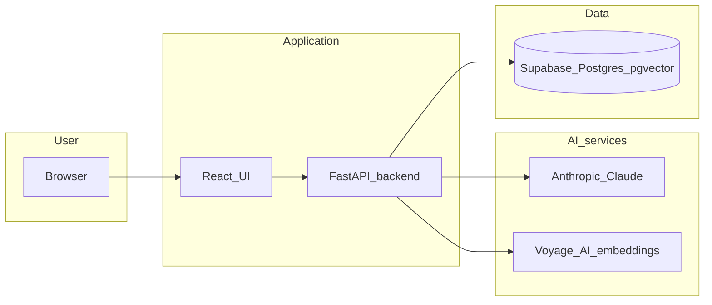
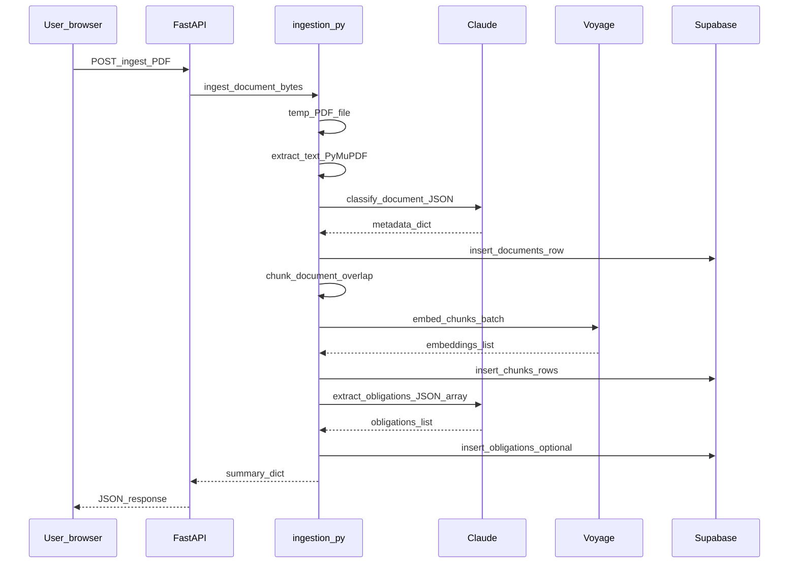

# sentinel — Day 1 Solution Design

**Document purpose:** This file describes *what* Day 1 delivers, *how* the pieces fit together, and *why* certain choices were made. It is written for both engineers and readers without a deep coding background.

**Status:** Reflects the codebase as implemented for the Day 1 vertical slice (local development).

---

## 1. Executive summary (plain English)

Day 1 turns **uploaded PDF contracts** into something the system can **search by meaning** and **answer questions about**, with answers **tied to the original document text** (citations).

In one sentence: **PDF in → text and metadata stored in the database → user asks a question → system finds the best matching passages → Claude writes an answer that only uses those passages and cites them.**

---

## 2. Day 1 goals and scope

### 2.1 Goals (from the project plan)

| Goal | Meaning for the user |
|------|----------------------|
| Upload PDF | User can add a contract file without manual data entry. |
| Store intelligently | The system reads the PDF, summarises it, splits it into searchable pieces, and saves those pieces with “meaning numbers” (embeddings). |
| Ask questions | User types a question in natural language. |
| Cited answers | The assistant’s reply points back to numbered snippets from the document so the user can verify claims. |

### 2.2 In scope (implemented or partially implemented)

- FastAPI backend with health, ingest, chat, and document metadata endpoints.
- Supabase: `vector` extension, `documents` table (extended in practice), `chunks` with embeddings, `obligations`, Row Level Security policies for local dev.
- Ingestion: PyMuPDF text extraction, Claude classification and obligation extraction, Voyage embeddings, bulk insert of chunks.
- Retrieval: semantic search via `match_chunks` RPC, keyword fallback, merge/dedupe.
- Chat: retrieve → format context → Claude answer with citation rules.
- React UI: Document Vault (upload + cards), Chat (markdown answers, expandable sources, auto-scroll, loading messages).

### 2.3 Out of scope for Day 1 (explicitly not required here)

- User authentication and multi-tenant isolation.
- “Which document did the user mean?” routing (orchestrator / intent filtering) — **see §10**.
- Production deployment, monitoring, full test automation.
- Google Drive sync, email sending, action queue (later days).

---

## 3. High-level architecture

### 3.1 What each layer does (non-technical)

- **React** runs in the browser and talks to the backend over HTTP.
- **FastAPI** is the “traffic controller”: it receives files and questions, runs Python code, and returns JSON.
- **Supabase** is the database: it stores documents, text chunks, vectors, and obligations.
- **Claude** reads text and writes structured summaries or answers.
- **Voyage AI** turns text into vectors so “similar meaning” search works.

### 3.2 Repository layout (technical)

| Path | Role |
|------|------|
| [`backend/api/main.py`](../backend/api/main.py) | HTTP routes, CORS, wires ingest/chat/document lookup. |
| [`backend/api/db.py`](../backend/api/db.py) | Single shared Supabase client (imported everywhere; do not duplicate). |
| [`backend/rag/ingestion.py`](../backend/rag/ingestion.py) | PDF → text → classify → DB row → chunk → embed → chunks table → obligations. |
| [`backend/rag/retrieval.py`](../backend/rag/retrieval.py) | Query embedding, `match_chunks`, keyword search, rerank; embed retry on rate limit. |
| [`backend/rag/chat.py`](../backend/rag/chat.py) | `retrieve` + context formatting + Claude chat completion. |
| [`frontend/src/pages/DocumentVault.jsx`](../frontend/src/pages/DocumentVault.jsx) | Upload UI and result cards. |
| [`frontend/src/pages/Chat.jsx`](../frontend/src/pages/Chat.jsx) | Chat UI, markdown, sources, document name fetch. |
| [`frontend/src/App.js`](../frontend/src/App.js) | Tab navigation between Vault and Chat. |

---

## 4. Data design

### 4.1 Core entities (conceptual)

| Entity | Plain English | Technical notes |
|--------|---------------|-----------------|
| **Document** | One uploaded file and its global metadata (vendor, dates, summary fields from Claude). | Stored in `documents`. `raw_text` holds full extracted text for audit/debug. |
| **Chunk** | A slice of the document text plus a vector representing its meaning. | Stored in `chunks`; linked to `documents` via `document_id`. |
| **Obligation** | A dated duty extracted from the contract (payment, renewal, notice, etc.). | Stored in `obligations`; linked via `document_id`. |

### 4.2 Embeddings and vector search

- **Model:** `voyage-large-2` (1024-dimensional vectors) for both ingestion (`embed_chunks`) and query (`embed` in retrieval).
- **Search function:** PostgreSQL RPC `match_chunks(query_embedding, match_threshold, match_count, filter_doc_ids)` compares the query vector to chunk vectors.  
  *Day 1 behaviour:* filtering by specific document IDs is supported by the RPC but **not yet exposed** through the chat API — retrieval searches across **all** chunks by default.

### 4.3 Row Level Security (RLS)

Supabase enables RLS by default. For the local single-user slice, permissive policies were added so the anon key can insert/select as needed. **Production** would replace this with authenticated users and proper policies.

---

## 5. API design

Base URL (local): `http://localhost:8000`

| Method | Path | Purpose | Request | Response (shape) |
|--------|------|---------|---------|-------------------|
| `GET` | `/health` | Liveness check | — | `{"status":"ok"}` |
| `POST` | `/ingest` | Run full ingestion on a PDF | `multipart/form-data` field `file` | `doc_id`, `metadata`, `chunk_count`, `obligation_count` |
| `POST` | `/chat` | Ask a question over ingested chunks | JSON `{"message":"..."}` | `answer` (markdown string), `sources` (array with `index`, `content`, `document_id`, `similarity`) |
| `GET` | `/documents/{doc_id}` | Lookup document metadata for UI | Path UUID | `id`, `filename`, `vendor_name`, `domain`, `status` |

**CORS:** Only `http://localhost:3000` is allowed (with credentials flag set for future cookie-based auth).

---

## 6. Ingestion pipeline (detailed)

### 6.1 Sequence (technical)

### 6.2 Step-by-step (plain English)

1. **Save the upload temporarily** so the PDF library can open it from disk.
2. **Read all pages** and join the text (PyMuPDF / `fitz`).
3. **Ask Claude** for a structured JSON summary (domain, vendor, dates, jurisdiction, summary, etc.).
4. **Save the document row** in Supabase. Extra fields from Claude that are not real DB columns are filtered out before insert.
5. **Split the text** into overlapping word windows (default 500 words, 50 overlap) so boundaries do not lose context.
6. **Turn each chunk into a vector** via Voyage and store chunk text + vector + index.
7. **Ask Claude again** for a list of obligations; insert if non-empty.
8. **Delete the temp file** always (`try`/`finally`).

### 6.3 Models and keys (operational)

- **Claude:** `claude-sonnet-4-6` (model IDs must match what your Anthropic account exposes; invalid IDs return HTTP 404 from the API).
- **Supabase Python client:** Pinned to `supabase==2.7.4` on Windows to avoid a transitive dependency (`pyiceberg`) that requires MSVC build tools on some installs.

---

## 7. Retrieval and chat pipeline

### 7.1 Retrieval flow

1. **Embed the user question** (same embedding model as chunks).
2. **Semantic search:** `supabase.rpc("match_chunks", …)` with threshold and count.
3. **Keyword search:** `ilike` on `chunks.content` for exact substring matches (helps dates, amounts, proper nouns).
4. **Rerank:** merge lists, prefer semantic hits, dedupe by chunk `id`, cap at 10, tag `source` as `semantic` or `keyword`.

### 7.2 Chat flow

1. Run `retrieve(message)`.
2. Build a numbered “Context” block (`[1] …`, `[2] …`, up to 400 characters per chunk in the prompt).
3. Call Claude with a **system prompt** that forbids hallucinations and requires bracket citations.
4. Return answer text plus up to five `sources` for the UI.

### 7.3 Rate limiting (Voyage)

Free-tier accounts without a billing method may see **~3 requests per minute** on embeddings. The backend retries with a **20-second** wait between attempts; the frontend shows **progressive status messages** so long waits feel intentional rather than “frozen.”

---

## 8. Frontend design

### 8.1 Navigation

- Sticky top bar with two tabs: **Document vault** and **Chat**.
- State `page` switches which page component mounts.

### 8.2 Document Vault

- Hidden file input (`accept=".pdf"`), styled drop zone.
- `axios.post` multipart to `/ingest`.
- Cards show filename, vendor (or “Unknown vendor”), chunk/obligation counts, italic summary.

### 8.3 Chat

- Message list: user (blue), assistant (gray + markdown via `react-markdown` + Tailwind Typography `prose`), error (red).
- **Sources:** expandable cards; filename loaded lazily via `GET /documents/{id}`.
- **Auto-scroll:** a bottom anchor `ref` scrolls into view when `messages` or `loading` changes.
- **Loading:** timed status strings + spinner.

---

## 9. Configuration and security

| Secret / config | Where | Never commit? |
|-----------------|-------|----------------|
| `ANTHROPIC_API_KEY` | `backend/.env` | Yes — listed in [`.gitignore`](../.gitignore) |
| `SUPABASE_URL`, `SUPABASE_KEY` (anon JWT) | `backend/.env` | Yes |
| `VOYAGE_API_KEY` | `backend/.env` | Yes |

**GitHub:** Repository should stay **private** unless you are certain no sensitive paths or test data should be public.

---

## 10. Known limitations (important for product expectations)

1. **Cross-document retrieval:** Chat searches **all** chunks in the database. If multiple contracts share similar legal wording, unrelated chunks can appear in “Sources” even when the user says “mobile.” **Mitigation (later):** pass `filter_doc_ids` from UI selection or from an orchestrator “intent” step.
2. **No per-user isolation:** Single dev user assumed; RLS is permissive for speed.
3. **Citation ↔ chunk alignment:** The model cites `[1]` against the numbered context block; the UI shows source cards — they should match, but there is no automated verifier yet (Day 3 guardrails territory).
4. **Embedding / chat costs:** Every question triggers at least one embedding call and one Claude call; ingestion triggers many more.

---

## 11. How to run locally (checklist)

| Step | Command / action |
|------|------------------|
| Backend venv | From `backend/`: `python -m venv venv`, activate, `pip install` dependencies per project docs. |
| Env file | Copy/configure `backend/.env` (never commit). |
| Supabase | Apply SQL: `vector` extension, tables, `match_chunks`, RLS policies as used in your project. |
| API | `uvicorn api.main:app --reload` from `backend/`. |
| Frontend | From `frontend/`: `npm install`, `npm start`. |

---

## 12. Traceability: plan vs code

| Plan item | Implementation anchor |
|-----------|-------------------------|
| Document ingestion | [`ingestion.py`](../backend/rag/ingestion.py) `ingest_document` |
| Hybrid retrieval | [`retrieval.py`](../backend/rag/retrieval.py) `retrieve` |
| Cited chat | [`chat.py`](../backend/rag/chat.py) `chat` |
| HTTP surface | [`main.py`](../backend/api/main.py) |
| Vault + Chat UI | [`DocumentVault.jsx`](../frontend/src/pages/DocumentVault.jsx), [`Chat.jsx`](../frontend/src/pages/Chat.jsx) |

---

## 13. Suggested next steps (Day 2 preview)

- Introduce an **orchestrator** or a lightweight **query router** to choose `filter_doc_ids` before retrieval.
- Log each pipeline step to a durable **activity** store for debugging and demos.
- Begin **`/analyse`** flow: risk scoring + draft actions (separate from Day 1 chat).

---

*End of Day 1 solution design.*
