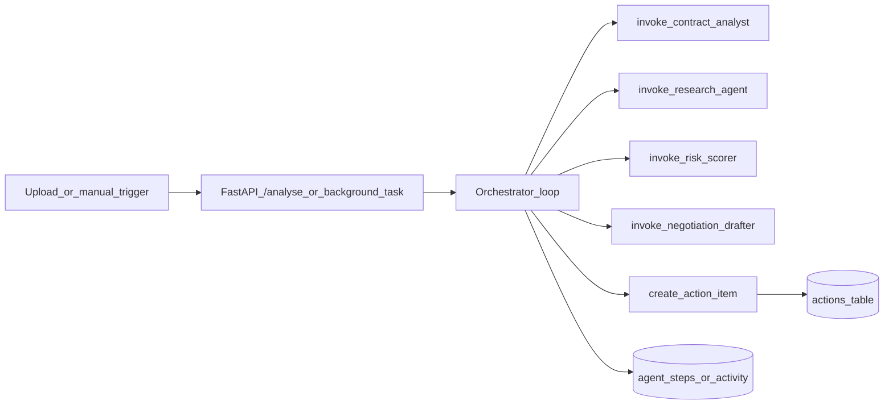
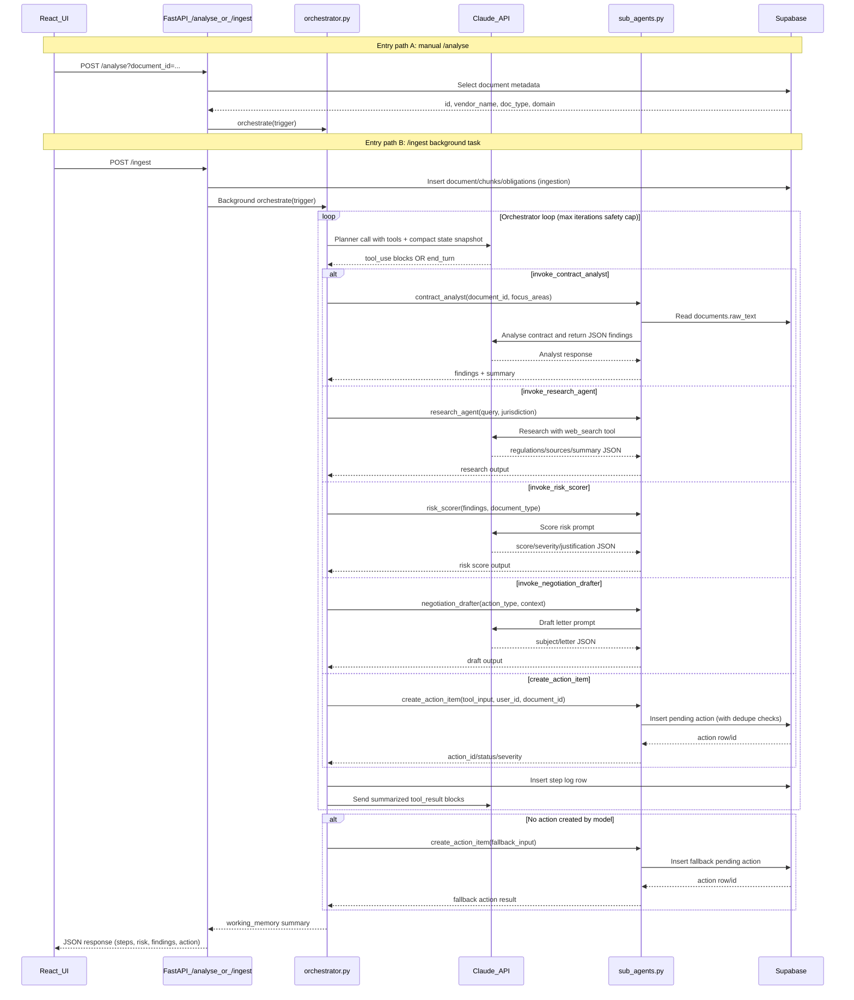

# sentinel — Day 2 Solution Design

**Document purpose:** This file explains what Day 2 delivers, how the orchestration layer works, and why key design decisions were taken.

**Status:** Reflects the Day 2 backend + frontend behavior as implemented in the local development environment.

---

## 1. Executive summary (plain English)

Day 2 upgrades the system from "ask questions over documents" to "run an autonomous analysis workflow" that creates a reviewable action for the user.

In one sentence: **Document in -> orchestrator runs analyst/research/scoring/drafting tools -> action item is created for user review, with dedupe and idempotency protections.**

---

## 2. Day 2 goals and scope

### 2.1 Goals

| Goal | Meaning for the user |
|------|----------------------|
| Autonomous analysis | System can run multi-step contract analysis without manual prompting for each step. |
| Action generation | The output becomes a concrete queue item the user can approve/reject later. |
| Stability under limits | Workflows continue even with API rate-limit spikes. |
| Duplicate protection | Same document or same analysis request does not repeatedly create clutter. |

### 2.2 In scope

- New `/analyse` API flow for already-ingested documents.
- Background analysis trigger from `/ingest`.
- Orchestrator with tool loop and safety limits.
- Sub-agents for analyst, research, risk scoring, draft creation, and action write.
- Idempotency and dedupe logic (`content_hash`, `analysis_key`, `action_fingerprint` patterns).
- Action Queue and Activity Log UI foundations.
- TXT ingestion support in addition to PDF.

### 2.3 Out of scope

- Full legal-grade validation and citation verification engine.
- Production-grade auth/multi-user policy model.
- Full automated test suite and deployment pipeline.

---

## 3. High-level architecture additions from Day 1

- Day 1 retrieval/chat remains available.
- Day 2 adds a second major lane: **analysis pipeline -> pending actions**.

---

## 4. Core design decisions (Day 2)

| Problem | Option considered | Decision |
|---------|-------------------|----------|
| LLM may end turn before final action tool | Trust prompt ordering only vs deterministic fallback in Python | Add deterministic fallback `create_action_item` |
| High token usage from full loop history | Keep full history vs compact state snapshot | Use compact snapshot + short recent tail |
| Rate-limit spikes (429) | Fail immediately vs retries with backoff | Retry with bounded exponential delays |
| Repeated expensive research calls | Unlimited research calls vs per-run cap | Cap research calls and log skips |
| Duplicate actions | Always insert vs fingerprint dedupe | Use action fingerprint + legacy fallback |
| Duplicate analyses | Run always vs request idempotency | Use `analysis_key` and `analysis_runs` (if table available) |

---

## 5. API design updates

Base URL (local): `http://localhost:8001`

| Method | Path | Purpose | Notes |
|--------|------|---------|-------|
| `POST` | `/analyse?document_id=...` | Run orchestrator on existing document | Returns steps, risk score, findings count, action summary |
| `POST` | `/ingest` | Ingest file and queue analysis in background | Returns quickly; orchestration continues asynchronously |
| `GET` | `/documents` | Feed table view in vault | Includes summary + classification fields |
| `GET` | `/actions` | List pending actions | For Action Queue page |
| `GET` | `/actions/activity` | Timeline feed | For Activity Log page |

---

## 6. Orchestrator pattern (Day 2)

### 6.1 Sequence

1. Build trigger context (`document_id`, vendor, doc type, domain).
2. Build compact working memory (findings, research summary, risk score, action state, tool cache).
3. Call Claude planner with tool schema (`ORCHESTRATOR_TOOLS`).
4. For each `tool_use` block returned by Claude:
   - Execute mapped sub-agent in Python (`execute_tool` dispatcher).
   - Persist step log to Supabase (`agent_steps`, and later activity stream).
   - Add compact `tool_result` back to model conversation.
5. Repeat loop until `end_turn`, non-tool stop, or max-iteration safety cap.
6. If no action was created, run deterministic fallback to guarantee one pending action.
7. Return condensed orchestration outcome (`steps_taken`, `risk_score`, `findings_count`, `action_item`).

### 6.2 Detailed sequence diagram (all major calls)

### 6.4 Safety controls

- Iteration cap (`MAX_ITERATIONS`) to avoid infinite loops.
- Tool result summarization to limit prompt growth.
- Rate-limit retry wrapper for Anthropic calls.
- Research-call cap to avoid runaway legal search loops.
- Deterministic fallback action creation if model ends early.

### 6.5 Tool-to-sub-agent map (quick reference)

| Orchestrator tool name | Python function called | External services touched |
|------------------------|------------------------|---------------------------|
| `invoke_contract_analyst` | `contract_analyst()` | Supabase (`documents` read) + Claude |
| `invoke_research_agent` | `research_agent()` | Claude (with web search tool) |
| `invoke_risk_scorer` | `risk_scorer()` | Claude |
| `invoke_negotiation_drafter` | `negotiation_drafter()` | Claude |
| `create_action_item` | `create_action_item()` | Supabase (`actions` write + dedupe checks) |

---

## 7. Data and schema decisions

### 7.1 Dedupe and idempotency model

| Layer | Key idea | Outcome |
|------|----------|---------|
| Ingestion | Content hash (`content_hash`) | Prevent duplicate document rows |
| Analysis API | Deterministic `analysis_key` | Reuse prior run or prevent concurrent duplicates |
| Action creation | `action_fingerprint` | Prevent same pending action duplicates |

### 7.2 Backward compatibility strategy

- If new tables/columns are missing, code degrades gracefully where possible.
- Legacy fallback paths are used instead of hard crashes for local iteration speed.

---

## 8. Frontend design updates (Day 2)

### 8.1 Document Vault improvements

- Added tabular list of all documents with status indicators.
- Added support messaging for duplicate upload detection.
- Added TXT support in upload UX.

### 8.2 New pages

- **Action Queue:** pending action cards and user decision controls.
- **Activity Log:** chronological feed of orchestrator activity.

---

## 9. Known limitations after Day 2

1. Model may still over-call some tools before finalization.
2. Some environments may run with partial schema migration, requiring compatibility paths.
3. Certain outputs still rely on fallback phrasing unless model finalization is stronger.
4. Action generation quality depends on parsed structured output quality from earlier steps.

---

## 10. How to run Day 2 flow locally

| Step | Action |
|------|--------|
| Start backend | `uvicorn api.main:app --reload --port 8001` |
| Start frontend | `npm start` in `frontend` |
| Upload contract | Use Document Vault (`.pdf` or `.txt`) |
| Verify background analysis | Check Action Queue + Activity Log |
| Manual retry | `POST /analyse` with document id |

---

## 11. Traceability: Day 2 anchors

| Area | File anchor |
|------|-------------|
| Orchestrator loop | `backend/agents/orchestrator.py` |
| Sub-agent implementations | `backend/agents/sub_agents.py` |
| Analysis endpoint/background trigger | `backend/api/main.py` |
| Action APIs | `backend/api/actions.py` |
| Vault/Queue/Activity pages | `frontend/src/pages/DocumentVault.jsx`, `ActionQueue.jsx`, `ActivityLog.jsx` |

---

## 12. Suggested next steps (Day 3 preview)

- Add robust guardrails on all generated outputs.
- Complete human-in-the-loop send flow and email audit.
- Expand activity model to include both user and agent events uniformly.

---

*End of Day 2 solution design.*
