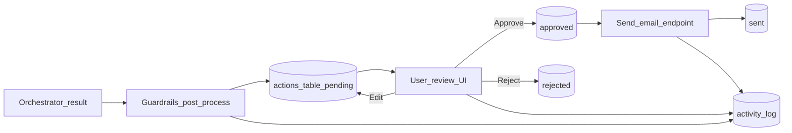

# Sentinel.AI — Day 3 Solution Design

**Document purpose:** This file describes what Day 3 adds on top of Day 2: safety guardrails, human approval controls, sending workflow, and audit visibility.

**Status:** Reflects the Day 3 behavior in the current local vertical slice.

---

## 1. Executive summary (plain English)

Day 3 makes the system safer and more operational by adding a human-in-the-loop queue, guardrails over agent output, and stronger activity/audit logging.

In one sentence: **Agent output is now post-processed for safety, queued for human decisions, and fully tracked through approval/send/audit events.**

---

## 2. Day 3 goals and scope

### 2.1 Goals

| Goal | Meaning for the user |
|------|----------------------|
| Guardrails | Drafts and findings get checked before users act on them. |
| Human control | User can approve, reject, edit, then send actions explicitly. |
| Audit trail | Timeline shows what system and user did, and when. |
| Operational confidence | Failures are visible and recoverable instead of silent. |

### 2.2 In scope

- Guardrails module and post-loop application in orchestrator.
- HITL endpoints for approve/reject/edit/send and queue detail retrieval.
- Email send integration with persistent audit rows.
- Activity timeline expansion (user + agent/system events).
- Action queue UX improvements (accordion sections, filter/search/sort).

### 2.3 Out of scope

- Legal sign-off engine or formal legal correctness guarantees.
- Enterprise-grade policy engine and role-based authorization.
- End-to-end production observability stack.

---

## 3. High-level Day 3 flow

---

## 4. Core design decisions (Day 3)

| Problem | Option considered | Decision |
|---------|-------------------|----------|
| Raw model output can be unsafe | Show raw output vs enforce post-processing | Add non-blocking guardrails pipeline |
| High-stakes actions might run automatically | Auto-send vs mandatory user approval | Mandatory HITL approval before send |
| Timeline visibility fragmented | Agent-only log vs unified event stream | Move to unified activity model (user + agent + system) |
| Failed analysis could look low-risk | Silent fallback vs explicit unresolved state | Mark unresolved states and push manual review path |

---

## 5. Guardrails design

### 5.1 What guardrails check

- Possible uncited factual claims.
- Legal caveat insertion on sensitive outputs.
- Basic PII redaction patterns.
- Scope escalation cues (content that suggests risky overreach).

### 5.2 Guardrail philosophy

- Guardrails are **annotating, not blocking** in this slice.
- User still sees output, but receives warnings and caveats.
- Keeps flow usable while improving safety transparency.

### 5.3 Integration point

- Applied near the end of orchestration on:
  - final action draft content
  - findings summaries

---

## 6. Human-in-the-loop (HITL) design

### 6.1 Endpoints

| Method | Path | Purpose |
|--------|------|---------|
| `GET` | `/actions` | List pending queue items |
| `GET` | `/actions/{id}` | Get full detail for one action |
| `PUT` | `/actions/{id}/approve` | Approve action |
| `PUT` | `/actions/{id}/reject` | Reject action, optional reason |
| `PUT` | `/actions/{id}/edit` | Edit draft content |
| `POST` | `/actions/{id}/send` | Send only approved action |
| `GET` | `/actions/activity` | Timeline feed |

### 6.2 Approval model

- Sending is not allowed until status is `approved`.
- Reject/edit decisions are recorded and visible.
- This creates a practical "double confirmation" pattern.

---

## 7. Email send and audit design

### 7.1 Decision

- Send through a dedicated backend module.
- Persist success/failure metadata to a dedicated `emails` table.

### 7.2 Why it matters

- You can prove what was attempted, when, and with what outcome.
- Failures become diagnosable instead of silent UI confusion.

---

## 8. Activity and observability design

### 8.1 Model

- Track events with source labels (`user`, `agent`, `system`).
- Include event type, summary, and created timestamp.
- Keep optional links to document/action context.

### 8.2 UX outcome

- Activity Log can answer:
  - "What did the agent do?"
  - "What did the user approve/reject?"
  - "What happened last?"

---

## 9. Frontend experience updates (Day 3)

### 9.1 Action Queue UX

- Compact cards for faster triage.
- Long sections behind chevrons/accordions:
  - draft email content
  - reasoning
  - sources
- Search/filter/sort added for operational use.

### 9.2 Activity Log UX

- Timeline format with autonomous vs human cues.
- Improves explainability during demos and debugging.

---

## 10. Data and migration notes

| Area | Data concern | Day 3 direction |
|------|--------------|-----------------|
| Actions | Status transitions + auditability | Explicit status lifecycle (`pending` -> `approved/rejected` -> `sent`) |
| Emails | Delivery tracking | Dedicated `emails` table |
| Activity | Unified timeline | `activity_log` table + fallback compatibility |
| Timestamps | Sort/debug consistency | Standardized `created_at` usage + indexes |

---

## 11. Known limitations after Day 3

1. Guardrails are heuristic and can produce false positives/negatives.
2. Some environments may still run without all migrations, requiring compatibility behavior.
3. Final legal quality still depends on source context quality and parsing reliability.
4. Email provider configuration is environment-dependent (key/from-address readiness).

---

## 12. How to run Day 3 flow locally

| Step | Action |
|------|--------|
| Start backend | `uvicorn api.main:app --reload --port 8001` |
| Start frontend | `npm start` in `frontend` |
| Upload or analyse | Trigger action creation |
| Open Action Queue | Review draft, edit, approve/reject |
| Send approved action | Use send control and confirm |
| Validate timeline | Check Activity Log updates |

---

## 13. Traceability: Day 3 anchors

| Area | File anchor |
|------|-------------|
| Guardrails logic | `backend/agents/guardrails.py` |
| Guardrails integration | `backend/agents/orchestrator.py` |
| HITL API routes | `backend/api/actions.py` |
| Email integration | `backend/api/email.py` |
| Activity logging helper | `backend/agents/step_logger.py` |
| Queue and card UI | `frontend/src/pages/ActionQueue.jsx`, `frontend/src/components/ActionCard.jsx` |
| Activity timeline UI | `frontend/src/pages/ActivityLog.jsx` |

---

## 14. Suggested next steps (Day 4 preview)

- Add memory-aware personalization into orchestrator triggers.
- Add scheduled monitoring/alerts for upcoming obligations.
- Improve parse-failure classification and recovery reporting.

---

*End of Day 3 solution design.*
