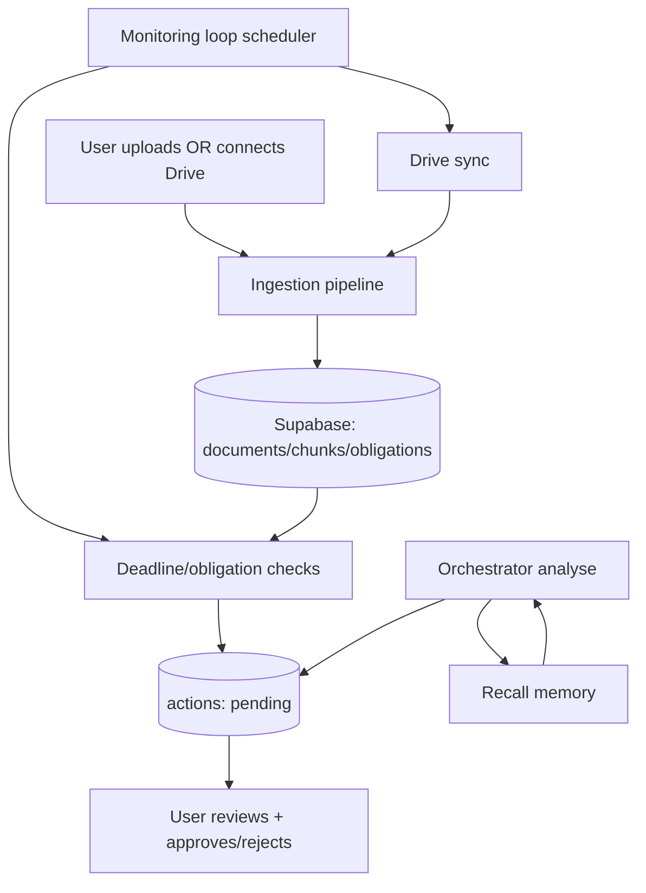

# sentinel — Day 4 Solution Design

**Document purpose:** This file describes what Day 4 adds on top of Day 3: long-term memory, Google Drive sync, and an always-on monitoring loop that creates user-visible alerts/actions.

**Status:** Written to match the current local vertical slice direction (FastAPI + Supabase + pgvector + React), including the “Drive sync” and “next scheduled sync” UI requirement.

---

## 1. Executive summary (plain English)

Day 4 turns sentinel from a “one-off analyser” into an **ongoing personal compliance assistant** by adding (a) long-term memory, (b) Drive ingestion as an always-on source, and (c) monitoring that automatically detects deadlines and creates user-visible queue items.

In one sentence: **The system remembers what matters, watches for new documents + deadlines, and proactively raises actions for the user to approve.**

---

## 2. Day 4 goals and scope

### 2.1 Goals

| Goal | Meaning for the user |
|------|----------------------|
| Memory | The app learns vendor history + user preferences so drafts are more personal and consistent. |
| Drive sync | Contracts/emails in Drive appear automatically in the Vault without manual upload. |
| Monitoring | The app proactively alerts the user before renewal / cancellation windows / payment deadlines. |
| Operational clarity | Dashboard shows “last sync” and “next scheduled sync”, so users can trust it’s running. |

### 2.2 In scope

- Long-term memory table usage (store and recall vendor history, preferences, outcomes).
- Memory recall integrated into analysis context (used by orchestrator/sub-agents).
- Google Drive sync endpoint (`POST /sync/drive`) and background monitor-triggered sync.
- Monitoring loop (scheduled) that:
  - runs Drive sync on an interval
  - detects upcoming obligations/deadlines
  - creates user-facing queue items (HITL) instead of taking automatic actions
- Dashboard “last sync” and “next scheduled sync” fields.

### 2.3 Out of scope

- Multi-user access control and enterprise-grade roles/permissions.
- Full production scheduler infrastructure (distributed locks, leader election).
- Fully automated sending (Day 4 still uses HITL approvals).

---

## 3. High-level Day 4 flow

---

## 4. Core design decisions (Day 4)

| Problem | Option considered | Decision |
|---------|-------------------|----------|
| Monitoring must not silently fail | “Best effort” background tasks vs scheduled loop with visible status | Add scheduled loop + dashboard timestamps |
| Agent needs personalization | Hardcode tone/preferences vs store memory per vendor/user | Store memory rows and recall into context |
| Drive duplicates & retries | Re-ingest everything each time vs dedupe with fingerprints | Use `source_fingerprint` (e.g., `gdrive:<file_id>`) + content hash |
| User safety | Auto-send vs “always create a pending action” | Monitoring creates queue items for approval only |

---

## 5. Long-term memory design

### 5.1 What is stored

Memory items are stored as rows keyed by `user_id`, `memory_type`, and `key`.

Examples:
- `memory_type="vendor"`, `key="British Telecom"` → “raised prices 8 months ago”
- `memory_type="preference"`, `key="draft_tone"` → “firm but polite”
- `memory_type="outcome"`, `key="bt_cancellation_2026_05"` → result notes

### 5.2 Why memory matters

- Improves relevance: “This vendor tends to do X” helps decide cancel vs negotiate.
- Improves UX: drafts sound consistent with the user’s style.
- Enables “learning”: outcomes become a feedback loop for better future recommendations.

### 5.3 Read/write integration points

- **On analysis start**: recall vendor history + preferences and include in orchestrator context.
- **On user decision** (approve/reject/send): write outcome memory to improve future recommendations.

---

## 6. Google Drive sync design

### 6.1 Source model

- Drive provides files; the system ingests them as `documents` with `source="google_drive"`.
- Dedupe uses `source_fingerprint = "gdrive:<file_id>"` (preferred) to prevent repeated ingestion.

### 6.2 Supported file types (Day 4 expectation)

- PDFs and common docs (docx)
- Plain text emails/letters (`.txt`, `mimeType="text/plain"`) so users can ingest price-rise emails

### 6.3 Key endpoint behavior

| Method | Path | Purpose |
|--------|------|---------|
| `POST` | `/sync/drive` | List new files in a folder and ingest new ones |

Important behavioral requirements:
- Logs what query was used against Drive (debuggable).
- Returns a summary: files seen, files ingested, files skipped (duplicate).

---

## 7. Monitoring loop design

### 7.1 Responsibilities

The monitoring loop runs on an interval (e.g., every 30–60 minutes) and:
- Triggers Drive sync (new files)
- Scans obligations and document metadata to find near-term deadlines
- Creates “pending” action items (HITL) such as:
  - “Renewal window closes in 7 days — review cancellation draft”
  - “Deposit protection deadline approaching”

### 7.2 Safety properties

- Monitoring **does not** send emails automatically.
- Monitoring can be retried safely (idempotent action fingerprints recommended).
- If the loop fails, the dashboard makes that visible (timestamps stop updating).

---

## 8. Dashboard status fields (operational clarity)

### 8.1 Fields

- `last_drive_sync_at`: last successful Drive sync time
- `next_scheduled_sync_at`: next scheduled monitoring tick time

### 8.2 Why this is product-critical

Without these timestamps, end users can’t tell whether the “agent” is actually watching anything. This converts background work into a visible, trustworthy product surface.

---

## 9. Data and migration notes (Day 4)

| Area | Data concern | Day 4 direction |
|------|--------------|-----------------|
| Documents | Dedupe across sources | `source_fingerprint` + content hash |
| Memory | Recall performance | pgvector index + match function for semantic recall |
| Actions | Avoid duplicates from monitoring | action fingerprints per (user, vendor, deadline type) |
| Sync status | Operational transparency | store last/next sync timestamps |

---

## 10. Known limitations after Day 4

1. Monitoring is still “single-process local” without distributed locking.
2. Memory quality depends on consistent vendor normalization (naming variance can reduce recall).
3. Deadlines/obligations extraction quality is bounded by document parsing and LLM correctness.

---

## 11. How to run Day 4 flow locally

| Step | Action |
|------|--------|
| Start backend | Run FastAPI on the project’s standard port (local convention: `8003`) |
| Trigger Drive sync | Call `POST /sync/drive` |
| View dashboard status | Confirm last/next sync timestamps show up |
| Validate monitoring | Run a manual “monitor tick” endpoint or scheduled job and confirm actions created |
| Review queue | Open Action Queue and approve/reject generated items |

---

## 12. Traceability: Day 4 anchors

| Area | File anchor |
|------|-------------|
| Drive integration | `backend/integrations/google_drive.py` (and legacy MCP integration file, if used) |
| Ingestion dedupe | `backend/rag/ingestion.py` (`source_fingerprint`) |
| Monitoring loop | `backend/agents/monitor.py` |
| Memory | `backend/memory/long_term.py` |
| Dashboard fields | `backend/api/main.py`, `frontend/src/pages/Dashboard.jsx` |

---

## 13. Suggested next steps (Day 5 preview)

- Expand regulatory knowledge base and tighten grounding/citation rules.
- Improve observability: agent step traces with latency/tokens and run IDs.
- End-to-end demo hardening and portability documentation (SQL + architecture).

---

*End of Day 4 solution design.*

