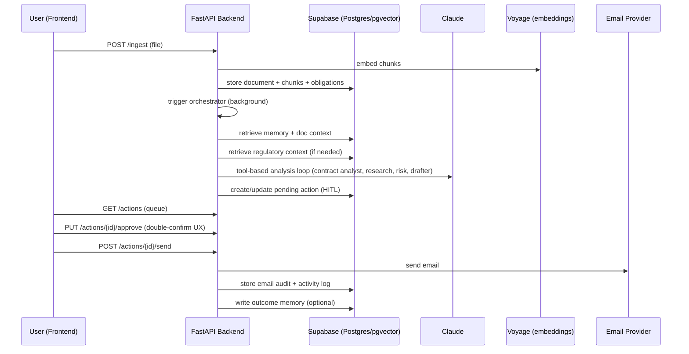

# sentinel — Day 5 Solution Design

**Document purpose:** This file describes what Day 5 adds on top of Day 4: integration hardening, “demo-ready” end-to-end flow, regulatory knowledge base expansion, and the portability + learning artefacts that make the system explainable and transferable.

**Status:** Reflects the intended “complete vertical slice” behavior with guardrails + HITL + memory + monitoring + regulatory RAG all functioning together.

---

## 1. Executive summary (plain English)

Day 5 is about making sentinel feel like a cohesive product: ingestion works reliably, analysis produces grounded results, user approvals lead to real outcomes (email send), and the system is observable and portable.

In one sentence: **Day 5 turns the working prototype into a reliable demo product with clear grounding, recovery paths, and documentation you can ship and explain.**

---

## 2. Day 5 goals and scope

### 2.1 Goals

| Goal | Meaning for the user |
|------|----------------------|
| End-to-end reliability | Upload → analyse → action queue → approve → send works consistently. |
| Grounded compliance guidance | Regulatory context is available locally and used before web search. |
| Demo clarity | UI surfaces tell a coherent story (Dashboard/Vault/Chat/Queue/Log). |
| Portability | All required DB SQL exists in one place; moving to another DB is realistic. |
| Honest explainability | Architecture + challenges + alternatives docs make the build interview-ready. |

### 2.2 In scope

- Regulatory RAG corpus: seeding, retrieval, and “research agent uses corpus first”.
- Consolidation into a skills library (typed interfaces) to reduce duplication and failures.
- Orchestrator resilience:
  - explicit failure statuses
  - informative fallback actions
  - “continue analysis” capability to recover incomplete runs
- Unified SQL setup file capturing tables/indexes/RPCs/RLS policies.
- End-to-end tests for the most brittle parts (RAG + guardrails).

### 2.3 Out of scope

- Full production deployment (Terraform, Kubernetes, etc.).
- Large-scale eval harness and automatic regression dashboards.
- Multi-tenant enterprise permissioning and key management.

---

## 3. High-level Day 5 flow (full product slice)

---

## 4. Core design decisions (Day 5)

| Problem | Option considered | Decision |
|---------|-------------------|----------|
| “Parse_error” from LLM JSON | Keep best-effort JSON vs structured output | Use tool schemas / structured outputs for reliability |
| Research cost + grounding | Always web search vs local regulatory corpus first | Query regulatory corpus first; web search only if insufficient |
| Orchestrator failures confusing | Silent failures vs actionable recovery | Create informative fallback actions + “Continue analysis” |
| Schema drift across environments | Ad-hoc SQL snippets vs consolidated setup file | Maintain `DATABASE_SETUP.sql` as source of truth |
| Prompt duplication | Copy prompts everywhere vs skills library | Use skill modules with typed interfaces and safe fallbacks |

---

## 5. Regulatory RAG (knowledge base) design

### 5.1 Purpose

Provide trustworthy “baseline rights” context without depending on live web search, improving:
- latency (local DB query)
- repeatability
- grounding/citations

### 5.2 Data model

- Table: `regulatory_chunks`
- Columns: `regulation_name`, `jurisdiction`, `domain`, `section_ref`, `content`, `embedding`
- Retrieval: `match_regulatory_chunks(query_embedding, threshold, count, jurisdiction, domain)`

### 5.3 Seeding workflow

| Method | Path | Purpose |
|--------|------|---------|
| `POST` | `/regulatory/seed` | Load initial UK corpus rows (safe to re-run) |

Key operational behaviors:
- Skips existing rows so re-seeding is idempotent.
- Retries embeddings if the embedding provider rate-limits.

---

## 6. Skills library design (stability + reuse)

### 6.1 Why skills matter

Skills turn “fragile prompt code” into small, testable, reusable modules:
- consistent model selection (env-driven)
- consistent error handling
- typed outputs for callers

### 6.2 Skills included (Day 5 expectation)

- obligations extraction
- clause risk scoring
- letter drafting
- summarisation
- price drift detection
- GDPR SAR generation

---

## 7. Orchestrator resilience & recovery design

### 7.1 Failure states

Explicit `analysis_status` values make failures intelligible:
- `completed`
- `incomplete` (loop ended without a final action)
- `rate_limited` (LLM 429 / token limits)
- `failed` (unexpected exception)

### 7.2 Fallback actions

If the orchestrator cannot complete, it still creates a **user-visible action** that:
- explains what failed in plain English
- suggests next step (“Continue analysis” or manual review)

### 7.3 Continue analysis

Users can re-run analysis from the UI, overwriting the fallback action instead of creating duplicates. This makes the system feel “recoverable” rather than flaky.

---

## 8. Portability / SQL “source of truth”

### 8.1 Goal

Make it realistic to port the app to another Postgres environment (or a different DB later) by having:
- all tables
- all indexes
- all RPC functions (vector match)
- all RLS policies

in a consolidated SQL file.

### 8.2 Why it matters commercially

If the DB schema can only be reproduced by “clicking around Supabase”, the product is not production-grade. A scripted schema is a minimum requirement for real deployments.

---

## 9. Demo readiness checklist (Day 5)

### 9.1 The “10-minute demo”

1. Upload contract (or sync Drive)
2. See it appear in Vault + Dashboard counts
3. Run analysis or wait for background orchestrator
4. Open Action Queue: see grounded draft with citations + guardrail caveat
5. Edit draft, approve, send
6. See Activity Log and email audit row
7. Ask Chat a question and get a cited answer (or a safe “not found”)

### 9.2 Operational confidence cues

- Dashboard shows last/next sync timestamps
- Activity Log shows orchestrator steps and failures
- Fallback actions are informative and recoverable

---

## 10. Known limitations after Day 5

1. No full evaluation harness for RAG/agents (beyond a small test suite).
2. No enterprise-grade observability stack (only basic logs/steps).
3. No true parallel fan-out of sub-agents for speed.
4. Still local-first; deployment hardening is a separate track.

---

## 11. How to run Day 5 flow locally

| Step | Action |
|------|--------|
| Start backend | Run FastAPI on the project’s standard port (local convention: `8003`) |
| Seed regulations | Call `POST /regulatory/seed` once |
| Ingest docs | Upload or `POST /sync/drive` |
| Run analysis | `POST /analyse` or background-triggered orchestration |
| Review queue | Approve/reject/edit |
| Send | Send only after approval |
| Validate | Activity log + email audit + memory write (if enabled) |

---

## 12. Traceability: Day 5 anchors

| Area | File anchor |
|------|-------------|
| Regulatory corpus | `backend/rag/regulatory.py` |
| Retrieval | `backend/rag/retrieval.py` |
| Orchestrator | `backend/agents/orchestrator.py` |
| Sub-agents | `backend/agents/sub_agents.py` |
| Skills | `backend/skills/*.py` |
| DB schema | `backend/sql/DATABASE_SETUP.sql` |
| Tests | `backend/tests/test_rag.py`, `backend/tests/test_guardrails.py` |
| Learning docs | `ARCHITECTURE.md`, `Learnings/challenges.md`, `Learnings/alternative_approaches.md` |

---

*End of Day 5 solution design.*

