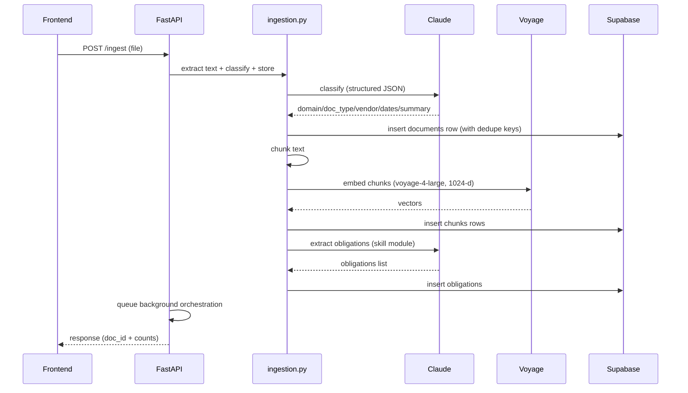

# sentinel — Overall Solution Design (current working system)

**Document purpose:** This file describes the complete sentinel vertical slice **as it works today** (not a future wishlist). It stitches together Day 1–5 capabilities into one coherent system design.

**Audience:** Engineers and non-technical readers preparing a demo, product brief, or interview discussion.

**Status:** Local development architecture with Supabase + Claude + Voyage + React.

---

## 1. Executive summary (plain English)

sentinel is a personal compliance and subscription governance assistant. Users upload or sync contracts/emails, the system extracts key details and obligations, then runs an agent workflow to produce **reviewable actions** (draft cancellation/complaint/negotiation letters) that the user must approve before anything is sent.

In one sentence: **Documents in → searchable knowledge base + obligations → agentic analysis with guardrails → human approval queue → optional email send → activity log + memory for future personalization.**

---

## 2. What the system delivers (capabilities)

### 2.1 End-user product surfaces

| Surface | What the user can do |
|--------|-----------------------|
| Dashboard | See overall counts and operational status (e.g., last sync / next scheduled sync). |
| Document Vault | Upload PDFs/TXT or view synced files and their extracted metadata. |
| Chat | Ask questions over uploaded documents and receive cited answers. |
| Action Queue | Review, edit, approve/reject, and send draft actions (HITL). |
| Activity Log | See a timeline of what the system and user did (debuggable + demo-friendly). |

### 2.2 Core backend lanes

1) **Ingestion lane:** file → text → classify → chunk → embed → store → obligations  
2) **Personal RAG lane:** query → retrieve chunks (semantic + keyword) → grounded answer  
3) **Regulatory RAG lane:** query → retrieve regulatory context (before web search)  
4) **Orchestrated analysis lane:** tool loop → findings/research/risk/draft → action creation  
5) **Monitoring lane:** scheduled sync + deadline checks → create pending actions/alerts  

---

## 3. High-level architecture

```mermaid
flowchart LR
  subgraph UI [Frontend (React + Tailwind)]
    Dash[Dashboard]
    Vault[Document Vault]
    Chat[Chat]
    Queue[Action Queue]
    Log[Activity Log]
  end

  subgraph API [Backend (FastAPI)]
    Ingest[/ingest/]
    Analyse[/analyse/]
    ChatAPI[/chat/]
    ActionsAPI[/actions/*/]
    Drive[/sync/drive/]
    Monitor[/monitor/*/]
    Seed[/regulatory/seed/]
  end

  subgraph Data [Supabase (Postgres + pgvector)]
    Docs[(documents)]
    Chunks[(chunks)]
    Oblig[(obligations)]
    Acts[(actions)]
    Steps[(agent_steps / activity_log)]
    Mem[(memory)]
    Reg[(regulatory_chunks)]
  end

  subgraph AI [AI services]
    Claude[Claude Sonnet (tools + JSON schemas)]
    Voyage[Voyage embeddings (1024-d)]
  end

  UI --> API
  API --> Data
  API --> Claude
  API --> Voyage
```

---

## 4. Data model (conceptual)

| Entity | Plain English meaning | Used by |
|--------|------------------------|---------|
| `documents` | One uploaded/synced file + extracted metadata + raw text | Vault, ingestion, orchestrator |
| `chunks` | Document slices + embeddings for semantic search | Chat, retrieval, grounding |
| `obligations` | Dated duties (renewal, notice, payments) | Monitoring, dashboard, analysis |
| `actions` | Pending/approved/rejected/sent items the user controls | Action Queue, email send |
| `activity_log` / `agent_steps` | Timeline of system/user events and agent steps | Activity Log, debugging |
| `memory` | Vendor history + user preferences + outcomes | Personalization, monitoring |
| `regulatory_chunks` | Curated regulation summaries + embeddings | Research agent, grounding |

Key persistence principles:
- **Idempotency:** avoid duplicates across ingestion and actions.
- **Auditability:** actions and sends are logged with timestamps and sources.
- **Grounding:** outputs reference retrieved chunks/regulatory context rather than free-form claims.

---

## 5. API surface (current system intent)

Local base URL convention (current project): `http://localhost:8003`

### 5.1 Ingestion and retrieval

| Method | Path | Purpose |
|--------|------|---------|
| `POST` | `/ingest` | Upload PDF/TXT and ingest; also triggers background analysis. |
| `GET` | `/documents` | List documents for Vault and Dashboard. |
| `GET` | `/documents/{id}` | Fetch document details for UI. |
| `POST` | `/chat` | Ask a question over documents; returns cited answer + sources. |
| `GET` | `/chat/history` | Load chat history for a session. |
| `DELETE` | `/chat/history` | Clear chat history for a session. |

### 5.2 Orchestrated analysis + actions

| Method | Path | Purpose |
|--------|------|---------|
| `POST` | `/analyse` | Run orchestrator analysis for a document (manual trigger). |
| `GET` | `/actions` | List actions (usually pending) for Action Queue. |
| `GET` | `/actions/{id}` | View one action (draft, reasoning, sources). |
| `PUT` | `/actions/{id}/approve` | Approve action. |
| `PUT` | `/actions/{id}/reject` | Reject action (optional reason). |
| `PUT` | `/actions/{id}/edit` | Edit draft content. |
| `POST` | `/actions/{id}/send` | Send approved action via email integration. |
| `POST` | `/actions/{id}/continue` | Resume analysis and overwrite fallback action (recovery path). |

### 5.3 Drive, monitoring, regulatory

| Method | Path | Purpose |
|--------|------|---------|
| `POST` | `/sync/drive` | List new Drive files and ingest them (deduped). |
| `POST` | `/monitor/run` | Trigger a monitoring cycle manually (useful for testing). |
| `POST` | `/regulatory/seed` | Seed regulatory corpus rows (safe to re-run). |

---

## 6. Ingestion pipeline (what happens when a file arrives)

### 6.1 Sequence (technical)



### 6.2 Dedupe strategy (important)

sentinel prevents duplicates using:
- **content hash** for “same file uploaded twice”
- **source fingerprint** for upstream sources (e.g., `gdrive:<file_id>`)

This matters because Drive sync and retries should not create duplicate documents.

---

## 7. Personal RAG (Chat) design

### 7.1 Retrieval strategy (hybrid)

1. Embed query (Voyage, 1024-d)
2. Semantic search via `match_chunks`
3. Keyword fallback for important literals (dates, amounts, names)
4. Merge and dedupe results; return top chunks for context

### 7.2 Chat grounding rules

Chat answers should:
- only use facts present in provided chunks
- cite chunk numbers (e.g., `[1]`, `[2]`)
- explicitly say “not found” when retrieval returns no chunks (no hallucination)

---

## 8. Regulatory RAG and research design

### 8.1 Why a regulatory corpus exists

Web search is useful but variable and slower. A local corpus:
- improves repeatability
- improves latency
- improves grounding for common rights and obligations

### 8.2 Research agent routing

The research agent first queries `regulatory_chunks`. If results are sufficient, it returns them **without web search**. If not, it falls back to web search with a note that the local corpus lacked coverage.

---

## 9. Orchestrator design (agentic tool loop)

### 9.1 Purpose

The orchestrator turns “raw document text” into a user-facing action by coordinating multiple sub-agents (tools).

### 9.2 Tools (conceptual)

| Tool | What it returns |
|------|------------------|
| Contract Analyst | Findings: risky clauses, obligations, missing protections |
| Research Agent | Relevant regulations (local corpus first; then web search) |
| Risk Scorer | Overall risk score and severity |
| Negotiation Drafter | Draft letter and subject line |
| Create Action Item | Writes/updates `actions` row for HITL |

### 9.3 Failure handling (production-style behaviour)

The orchestrator tracks an `analysis_status`:
- `completed` (action created normally)
- `rate_limited` (LLM 429)
- `incomplete` (loop ended without action)
- `failed` (unexpected error)

If the loop cannot complete, the backend still creates a **fallback action** that:
- explains what went wrong
- tells the user what to do next
- exposes a **Continue analysis** option from the UI

This prevents “silent failure” and keeps the queue usable.

---

## 10. Guardrails + HITL (safety and control)

### 10.1 Guardrails layer

Guardrails post-process sensitive outputs (especially letters) to:
- inject a legal/AI caveat
- redact obvious PII patterns
- flag scope escalation triggers
- warn about uncited claims (heuristic)

Guardrails are designed to keep the system safe while preserving usability.

### 10.2 Human-in-the-loop workflow (HITL)

- Actions are created as `pending`
- User can edit, approve, reject
- Only `approved` actions can be sent
- Sending creates an audit trail (email record + activity event)

This is critical for user trust: the agent drafts, but the user decides.

---

## 11. Monitoring loop (always-on behaviour)

### 11.1 What it does

On a schedule (and manually for testing), monitoring:
- syncs Drive for new documents
- scans obligations for upcoming deadlines
- creates pending actions/alerts (never auto-sends)

### 11.2 Why dashboard sync timestamps matter

To a consumer, monitoring is only real if it’s visible:
- last successful sync time
- next scheduled sync time

This converts background automation into a product trust signal.

---

## 12. Key production risks (current system awareness)

| Risk | Why it matters | Mitigation direction |
|------|----------------|----------------------|
| Schema drift (vector dimensions) | breaks ingestion/retrieval silently | keep one embedding model and enforce DB type + tests |
| Network instability (Supabase) | breaks UI pages and agent flows | centralized retries + graceful error responses |
| LLM structured output failures | downstream tools fail | tool schemas + validation + safe fallbacks |
| Prompt injection from documents | can steer agent/tool use | strict grounding + tool allowlists + guardrails |
| Rate limits and cost | workflows degrade under load | budgeting, caching, queueing, model routing |

---

## 13. How to run the full system locally (demo checklist)

| Step | What to do | What you should see |
|------|------------|---------------------|
| Start backend | Run FastAPI on `8003` | `/health` OK |
| Start frontend | React dev server | All pages load |
| Seed regulations | `POST /regulatory/seed` | `seeded` count > 0 |
| Ingest docs | Upload PDF/TXT or run Drive sync | Document appears in Vault |
| Wait/run analysis | background orchestrator or `POST /analyse` | Pending action appears |
| Review action | Approve/edit/reject | Activity log updates |
| Send | Send only after approval | Email audit + sent status |

---

## 14. Traceability: main implementation anchors

| Area | File anchor |
|------|-------------|
| API routes | `backend/api/main.py`, `backend/api/actions.py` |
| Ingestion | `backend/rag/ingestion.py` |
| Retrieval | `backend/rag/retrieval.py` |
| Chat | `backend/rag/chat.py` |
| Regulatory corpus | `backend/rag/regulatory.py` |
| Orchestrator | `backend/agents/orchestrator.py`, `backend/agents/sub_agents.py` |
| Guardrails | `backend/agents/guardrails.py` |
| Monitoring | `backend/agents/monitor.py` |
| Memory | `backend/memory/long_term.py` |
| DB portability | `backend/sql/DATABASE_SETUP.sql` |
| Frontend pages | `frontend/src/pages/*`, `frontend/src/components/*` |

---

*End of overall solution design.*

